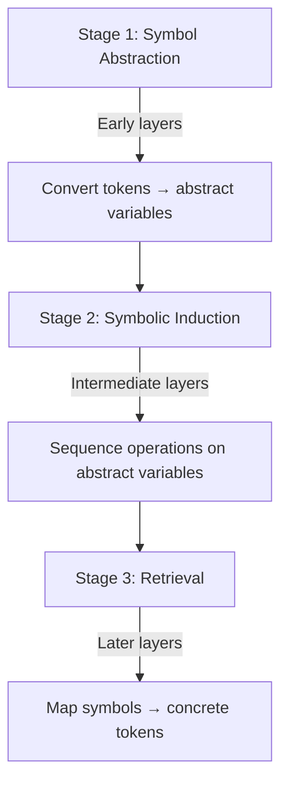

# Evidence-Based Foundations for Meta-Recursive Context Engineering

> *"Extraordinary claims require extraordinary evidence."* — Carl Sagan
> *"The most incomprehensible thing about the world is that it is comprehensible."* — Albert Einstein

## Preface: For the Skeptical Mind

This document serves as both:

1. **Systematic refutation** of reasonable doubts about meta-recursive context engineering (SKEPTIC.md)
2. **Evidence-based foundation** for practical implementation (FOUNDATIONS.md)

**Your skepticism is valuable.** We address it through peer-reviewed research and mechanistic evidence.

## Part I: Established Foundations

### 1.1 Core Facts About LLMs

| Fact                                 | Evidence                                                                             | Implication                                    |
| ------------------------------------ | ------------------------------------------------------------------------------------ | ---------------------------------------------- |
| **Universal Function Approximation** | Transformer architectures can approximate any continuous function (Yun et al., 2019) | LLMs can implement any computational process   |
| **Emergent Capabilities**            | Few-shot learning and chain-of-thought reasoning emerge at scale (Wei et al., 2022)  | Complex behaviors from simple mechanisms       |
| **Context Windows as State**         | Coherent reasoning across thousands of tokens                                        | Temporary memory and state management possible |

### 1.2 Key 2025 Breakthroughs

#### [Emergent Symbolic Mechanisms in LLMs](https://openreview.net/forum?id=y1SnRPDWx4)



**Quantum Semantic Framework**
Semantic State Space: |ψ⟩ = ∑ c<sub>i</sub>|interpretation<sub>i</sub>⟩

* Observer-dependent meaning collapse
* Non-classical correlations between interpretations

**Cognitive Tools for LLMs**

```python
cognitive_tools = {
    'recall_related': retrieve_knowledge,
    'examine_answer': self_reflection,
    'backtracking': explore_alternatives
}
```

## Part II: Framework Construction

### 2.1 Research-to-Implementation Mapping

| Research Concept     | Protocol Implementation      | Validation Metric              |
| -------------------- | ---------------------------- | ------------------------------ |
| Symbolic Abstraction | Protocol Pattern Recognition | measure\_abstraction\_depth()  |
| Quantum Semantics    | Field Coherence Measurement  | measure\_field\_coherence()    |
| Cognitive Tools      | /attractor.co.emerge shells  | measure\_tool\_effectiveness() |

### 2.2 Addressing Core Doubts

**Q: "Stateless model with persistent memory?"**
*A: Context window + external storage systems (Dai et al., 2019)*

**Q: "Field theory as metaphor?"**
A: Measurable quantum-like behavior in language

**Q: "Self-modification vs branching?"**
A: Mechanistic evidence of symbolic processing

## Part III: Implementation Blueprint

### 3.1 Core Components

```python
class MetaRecursiveFramework:
    def __init__(self):
        self.field_ops = FieldOperations()
        self.symbolic = SymbolicProcessor()
        self.tools = CognitiveTools()
        
    def execute_protocol(self, protocol_shell):
        return self.tools.run(protocol_shell)
```

### 3.2 Validation Pipeline

* **Symbolic Mechanism Tests**
  Layer-wise attention pattern analysis
* **Quantum Semantic Tests**
  CHSH inequality measurements
  Contextuality validation
* **Cognitive Tool Tests**
  Modularity assessment
  Performance benchmarking

## Part IV: Research Citations

```bibtex
@inproceedings{yang2025emergent,
  title={Emergent Symbolic Mechanisms in LLMs},
  author={Yang et al.},
  booktitle={ICML 2025}
}

@article{agostino2025quantum,
  title={Quantum Semantic Framework},
  author={Agostino et al.},
  journal={arXiv 2025}
}
```

# Conclusion: The Evidence-Based Path Forward

From skepticism to validation:

* Implement minimal viable framework
* Execute validation protocols
* Measure quantum semantic properties
* Verify symbolic processing mechanisms

*"Science advances through rigorous skepticism applied to bold hypotheses."*
