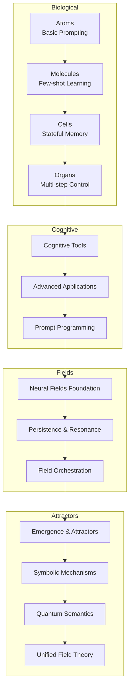
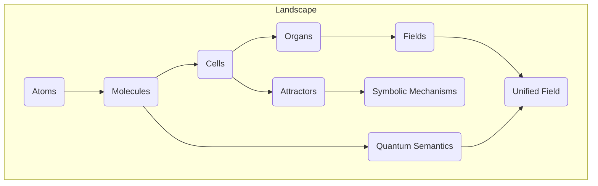

# Foundations

> *From atoms to unified fields: The theoretical backbone of context engineering*
>
> **“Order emerges from the interactions of chaos."
> — Ilya Prigogine**

## [Learn to Visualize Context as Semantic Networks and Fields](https://claude.ai/public/artifacts/6a078ba1-7941-43ef-aab1-bad800a3e10c)

## Overview

The `00_foundations` directory contains the core theoretical foundations of context engineering, progressing from basic prompting concepts to advanced unified field theory. Each module builds on the previous ones, creating a comprehensive framework for understanding and manipulating context in large language models.

---

## Biological Metaphor

Our approach is structured around a biological metaphor that provides an intuitive framework for understanding the increasing complexity of context engineering:

| Level | Metaphor           | Context Engineering Concept           |
| ----- | ------------------ | ------------------------------------- |
| 1     | **Atoms**          | Basic instructions and prompts        |
| 2     | **Molecules**      | Few-shot examples and demonstrations  |
| 3     | **Cells**          | Stateful memory and conversation      |
| 4     | **Organs**         | Multi-step applications and workflows |
| 5     | **Neural Systems** | Cognitive tools and mental models     |
| 6     | **Neural Fields**  | Continuous semantic landscapes        |

As we progress through these levels, we move from discrete, static approaches to more continuous, dynamic, and emergent systems.

---

## Module Progression

### Biological Foundation (Atoms → Organs)

1. [**01\_atoms\_prompting.md**](./01_atoms_prompting.md)
2. [**02\_molecules\_context.md**](./02_molecules_context.md)
3. [**03\_cells\_memory.md**](./03_cells_memory.md)
4. [**04\_organs\_applications.md**](./04_organs_applications.md)

### Cognitive Extensions

5. [**05\_cognitive\_tools.md**](./05_cognitive_tools.md)
6. [**06\_advanced\_applications.md**](./06_advanced_applications.md)
7. [**07\_prompt\_programming.md**](./07_prompt_programming.md)

### Field Theory Foundation

8. [**08\_neural\_fields\_foundations.md**](./08_neural_fields_foundations.md)
9. [**09\_persistence\_and\_resonance.md**](./09_persistence_and_resonance.md)
10. [**10\_field\_orchestration.md**](./10_field_orchestration.md)

### Advanced Theoretical Framework

11. [**11\_emergence\_and\_attractor\_dynamics.md**](./11_emergence_and_attractor_dynamics.md)
12. [**12\_symbolic\_mechanisms.md**](./12_symbolic_mechanisms.md)
13. [**13\_quantum\_semantics.md**](./13_quantum_semantics.md)
14. [**14\_unified\_field\_theory.md**](./14_unified_field_theory.md)

---

## Learning Approach

Each module follows these principles:

1. **Multi-perspective learning**
2. **Intuition-first**
3. **Progressive complexity**
4. **Practical grounding**
5. **Socratic questioning**

## Reading Order

### For Prompt Engineers

1 → 2 → 3 → 4 → 7 → 5

### For Field Theory Enthusiasts

8 → 9 → 10 → 11 → 14

### For Symbolic Mechanism Fans

12 → 13 → 14

### For Complete Understanding

Follow the full sequence from 1 to 14

---

## Integration with Other Directories

The theoretical foundations here support practical implementations across:

* **10\_guides\_zero\_to\_hero**: Practical notebooks
* **20\_templates**: Modular components
* **30\_examples**: Real-world use cases
* **40\_reference**: Reference guides
* **60\_protocols**: Protocol shells
* **70\_agents**: Agent implementations
* **80\_field\_integration**: End-to-end systems

---

## Field-Based Learning Map

---

*"The most incomprehensible thing about the world is that it is comprehensible."*
— Albert Einstein

---

**Summary**

The `00_foundations` directory provides a comprehensive theoretical framework for context engineering, organized around a biological metaphor that progresses from basic prompting concepts to advanced unified field theory. It includes modules on biological foundations, cognitive extensions, field theory foundations, and advanced theoretical frameworks. Each module follows principles of multi-perspective learning, intuition-first, progressive complexity, practical grounding, and Socratic questioning. The directory integrates with other directories for practical implementations and provides different reading orders based on the reader's background and interests. The field-based learning map illustrates the relationships between different concepts and modules.
